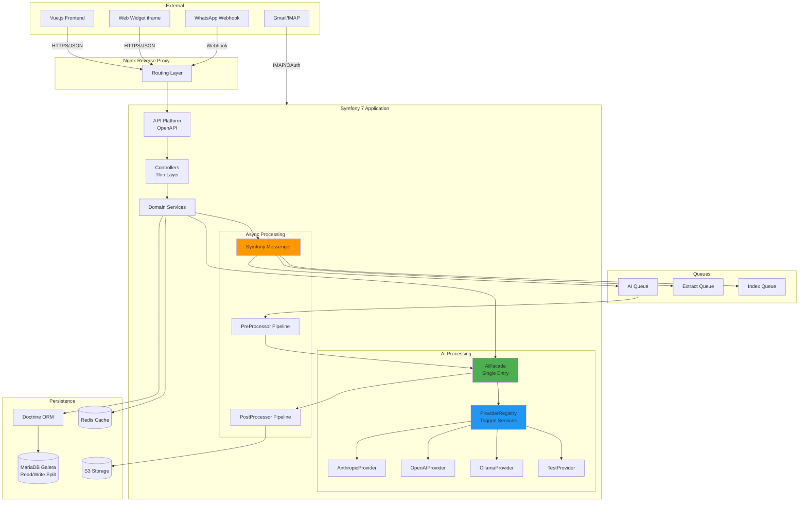
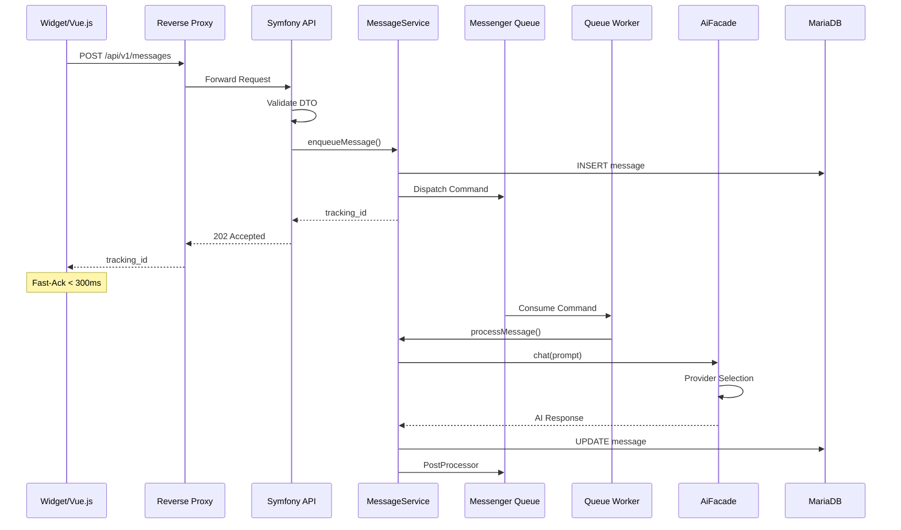
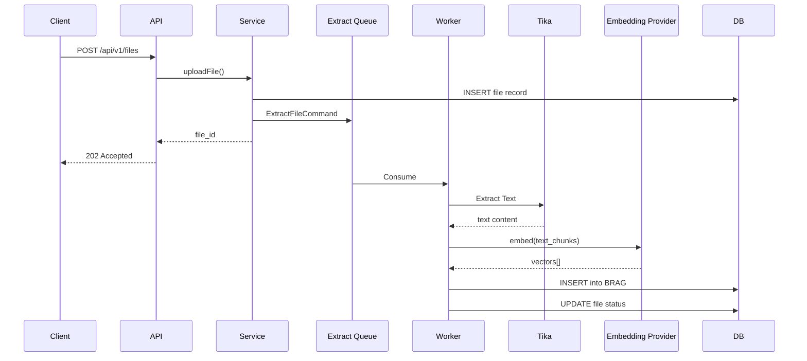
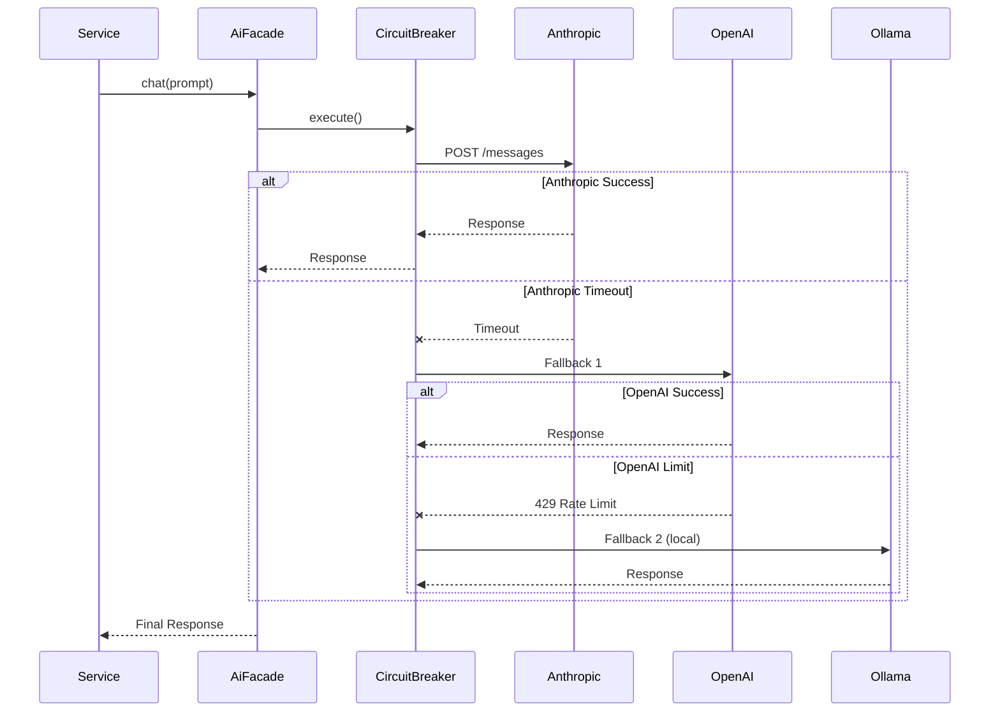

# Synaplan Symfony 7 – Architektur-Dokumentation

## Übersicht

Diese Architektur implementiert einen **API-first, event-driven Ansatz** mit klarer Trennung zwischen Request-Handling (synchron, schnell) und AI-Processing (asynchron, Queue-basiert).

## Systemübersicht (Mermaid)



## Schichtenmodell

### Layer 1: Presentation / API (HTTP)

**Komponenten**:
- **API Platform**: Auto-generiert OpenAPI-Docs, Validierung, Serialization
- **Controllers**: Dünne Schicht, delegiert an Services
- **Security**: JWT/API-Key Auth, OIDC Integration

**Verantwortlichkeiten**:
- HTTP Request/Response Handling
- Input Validation (DTO-basiert)
- Authentication & Authorization
- Fast-Ack für async Operations (< 300 ms)

**Keine Business-Logik in Controllern!**

```php
// Beispiel: MessageController
#[Route('/api/v1/messages', name: 'api_messages_create', methods: ['POST'])]
public function create(
    CreateMessageRequest $request,
    MessageService $messageService
): JsonResponse {
    // Fast-Ack: Message in Queue, return Tracking-ID
    $trackingId = $messageService->enqueueMessage($request);
    
    return new JsonResponse([
        'tracking_id' => $trackingId,
        'status' => 'queued'
    ], 202); // Accepted
}
```

### Layer 2: Application / Services (Business Logic)

**Komponenten**:
- **Domain Services**: Business-Logik (MessageService, UserService, PromptService)
- **AiFacade**: Single Entry Point für AI-Calls
- **ProviderRegistry**: Dynamische Provider-Auswahl
- **Event Dispatcher**: Domain Events

**Verantwortlichkeiten**:
- Business-Logik orchestrieren
- Transaktions-Management
- Event-Publishing (Outbox Pattern)
- Service-zu-Service Calls

```php
// Beispiel: MessageService
class MessageService
{
    public function __construct(
        private MessageRepository $repository,
        private MessageBus $bus,
        private AiFacade $aiFacade
    ) {}

    public function enqueueMessage(CreateMessageRequest $request): string
    {
        $message = Message::create($request);
        $this->repository->save($message);
        
        // Async Processing via Messenger
        $this->bus->dispatch(new ProcessMessageCommand($message->getId()));
        
        return $message->getTrackingId();
    }
}
```

### Layer 3: AI Processing (Strategy Pattern)

**Komponenten**:
- **AiFacade**: Einziger Einstiegspunkt für AI-Funktionen
- **ProviderRegistry**: Registriert alle Provider mit Tags
- **ChatProviderInterface**: Text-Generierung (streaming/non-streaming)
- **VisionProviderInterface**: Bild-Analyse
- **EmbeddingProviderInterface**: Vector-Embeddings
- **ImageGenerationProviderInterface**: Bild-Generierung
- **SpeechToTextProviderInterface**: Audio → Text
- **TextToSpeechProviderInterface**: Text → Audio
- **FileAnalysisProviderInterface**: Datei-Analyse

**Design-Entscheidungen**:
- **Keine statischen Klassen**: Alle Provider als Services
- **HttpClient**: Symfony HttpClient statt curl
- **Circuit Breaker**: Automatisches Fallback bei Timeouts
- **Rate Limiting**: Per Provider und User

```php
// Beispiel: AiFacade
class AiFacade
{
    public function __construct(
        private ProviderRegistry $registry,
        private RateLimiter $rateLimiter,
        private CircuitBreaker $circuitBreaker
    ) {}

    public function chat(string $prompt, array $options = []): string
    {
        $provider = $this->registry->getChatProvider($options['provider'] ?? null);
        
        // Rate Limiting
        $this->rateLimiter->checkLimit($provider->getName());
        
        // Circuit Breaker
        return $this->circuitBreaker->execute(
            fn() => $provider->simplePrompt($prompt, $options)
        );
    }
}
```

### Layer 4: Async Processing (Queues)

**Komponenten**:
- **Symfony Messenger**: Transport (Redis/RabbitMQ)
- **Message Handlers**: Konsumieren Queue-Messages
- **PreProcessor Pipeline**: File-Extract, Vision, Vectorize
- **PostProcessor Pipeline**: Formatting, Output-Routing

**Queues**:
```yaml
# config/packages/messenger.yaml
framework:
    messenger:
        transports:
            # High Priority: AI Processing
            ai_high: 
                dsn: '%env(MESSENGER_AI_HIGH_DSN)%'
                options:
                    stream_max_entries: 10000
                    
            # Medium Priority: File Extraction
            extract: 
                dsn: '%env(MESSENGER_EXTRACT_DSN)%'
                
            # Low Priority: Indexing
            index:
                dsn: '%env(MESSENGER_INDEX_DSN)%'
                options:
                    auto_setup: true
                    
        routing:
            'App\Message\ProcessMessageCommand': ai_high
            'App\Message\ExtractFileCommand': extract
            'App\Message\IndexDocumentCommand': index
```

**PreProcessor Pipeline**:
1. **File Download**: Von URL/Upload holen
2. **Extract Text**: Tika-first, dann OCR-Fallback (Vision AI)
3. **Detect Language**: Sprache erkennen
4. **Vectorize**: Embeddings generieren
5. **Store Metadata**: In DB speichern

**PostProcessor Pipeline**:
1. **Format Response**: JSON/Markdown/HTML
2. **Apply Policies**: Content-Moderation, Filter
3. **Route Output**: E-Mail/WhatsApp/Webhook/Widget
4. **Trigger Webhooks**: Partner-Integrationen
5. **Update Status**: Message → "completed"

### Layer 5: Persistence (Doctrine + Redis)

**Komponenten**:
- **Doctrine ORM**: Entity-Mapping, Repositories
- **Read/Write Splitting**: Master für Writes, Replicas für Reads
- **Redis**: Session, HTTP-Cache, 2nd Level Cache, Rate-Limiter
- **Outbox Pattern**: Event-Table für externe Systeme

**Doctrine Konfiguration**:
```yaml
# config/packages/doctrine.yaml
doctrine:
    dbal:
        default_connection: default
        connections:
            default:
                url: '%env(resolve:DATABASE_WRITE_URL)%'
                driver: 'pdo_mysql'
                charset: utf8mb4
                
            read:
                url: '%env(resolve:DATABASE_READ_URL)%'
                driver: 'pdo_mysql'
                charset: utf8mb4
                
    orm:
        entity_managers:
            default:
                connection: default
                # Write-Operationen
                
            read:
                connection: read
                # Read-Only Queries
```

**Redis-Nutzung**:
- **Session Storage**: Shared Sessions über Server hinweg
- **HTTP Cache**: ETags, Cache-Control Headers
- **2nd Level Cache**: Query Result Cache
- **Rate Limiter**: Token-Bucket per User/API-Key
- **Lock Management**: Distributed Locks für Galera

## EVA-Flows (Eingabe-Verarbeitung-Ausgabe)

### Flow 1: Chat Message (Widget/Frontend)



### Flow 2: File Upload mit Extract & Vectorize



### Flow 3: AI Processing mit Fallback-Chain



## Inference Router Service

**Zweck**: Load-Balancing über mehrere AI-Provider/Instanzen mit Health-Checks und Capacity-Management.

```php
class InferenceRouter
{
    private array $providers = [];
    
    public function route(string $capability, array $options = []): ProviderInterface
    {
        $candidates = $this->registry->getByCapability($capability);
        
        // Filter by Health
        $healthy = array_filter($candidates, fn($p) => $p->isHealthy());
        
        if (empty($healthy)) {
            throw new NoHealthyProviderException();
        }
        
        // Strategy: Least Connections (oder Round-Robin, Weighted)
        usort($healthy, fn($a, $b) => 
            $a->getActiveConnections() <=> $b->getActiveConnections()
        );
        
        return $healthy[0];
    }
}
```

**Health Check**:
- **Endpoint**: `GET /health` pro Provider
- **Metriken**: Latency, Error Rate, Queue Length
- **Circuit State**: Open/Half-Open/Closed
- **Capacity**: Max Concurrent Requests

## Partner-Extensions & Hooks

**n8n-Style Workflow-Hooks** an definierten Extension Points:

```php
interface WorkflowHookInterface
{
    public function execute(array $context): array;
}

// Extension Points:
class HookRegistry
{
    const PRE_AI_PROCESSING = 'pre_ai';
    const POST_AI_PROCESSING = 'post_ai';
    const PRE_FILE_EXTRACT = 'pre_extract';
    const POST_FILE_EXTRACT = 'post_extract';
    const PRE_OUTPUT = 'pre_output';
}

// Partner kann eigene Hooks registrieren:
class CustomModerationHook implements WorkflowHookInterface
{
    public function execute(array $context): array
    {
        // Content-Filter, Custom-Logic
        return $context; // modified
    }
}
```

**Tool-Plugins** (UI-seitig via JSON):
```json
{
  "tool_id": "partner_crm_lookup",
  "name": "CRM Customer Lookup",
  "input_schema": {
    "type": "object",
    "properties": {
      "customer_id": {"type": "string"}
    }
  },
  "endpoint": "https://partner.com/api/crm/lookup",
  "auth": "bearer_token"
}
```

## Skalierungs-Strategie

### Horizontal Scaling (Web)
- **Stateless Services**: Keine Session-Affinität
- **Shared Redis**: Session, Cache, Locks
- **Load Balancer**: Nginx/Traefik mit Health-Checks

### Database Scaling (Galera)
- **Single-Writer**: Nur ein Node für Writes (vermeidet Conflicts)
- **Read Replicas**: N Nodes für Read-Traffic
- **Connection Pooling**: pgBouncer-Style (Doctrine DBAL)
- **Sharding**: User-basiert (falls > 10M User)

### Queue Scaling (Messenger)
- **Separate Transports**: AI / Extract / Index
- **Worker Autoscaling**: Basierend auf Queue-Länge
- **Priority Queues**: High/Medium/Low
- **Backpressure**: Queue-Limit → HTTP 429

### AI Provider Scaling
- **Multiple Ollama Instances**: Docker Swarm / K8s
- **InferenceRouter**: Least-Connections Load-Balancing
- **Queue per Model**: gpt-4o vs. llama3.2 separate Queues

## Security-Architektur

### Authentication
- **JWT Tokens**: Für Vue.js Frontend
- **API Keys**: Für externe Integrations
- **OIDC**: Partner-SSO (Google, Microsoft, Custom)
- **Session Bridge**: Legacy PHP Sessions → Symfony Security

### Authorization
- **Voter-Pattern**: Symfony Security Voters
- **RBAC**: Role-Based (NEW, PRO, TEAM, BUSINESS)
- **Scope-Based**: API-Key Permissions (read:messages, write:messages)

### Rate Limiting
- **Per User**: Token-Bucket in Redis
- **Per API Key**: Separate Limits
- **Per Provider**: Avoid Quota-Überschreitung
- **Per Operation**: text2pic, text2vid, analyzefile

### Content Security
- **CORS**: Strict Origin-Whitelisting
- **CSP Headers**: Content-Security-Policy
- **Input Validation**: Symfony Validator Constraints
- **Output Encoding**: Auto via Twig/Serializer

## Observability

### Logging (Monolog)
```yaml
monolog:
    channels: ['app', 'ai', 'security', 'performance']
    handlers:
        main:
            type: rotating_file
            path: '%kernel.logs_dir%/%kernel.environment%.log'
            level: info
            channels: ['!event']
        ai:
            type: rotating_file
            path: '%kernel.logs_dir%/ai.log'
            level: debug
            channels: ['ai']
```

### Metriken (Prometheus)
- **Request Latency**: Histogram (p50, p95, p99)
- **Error Rate**: Counter per Endpoint
- **AI Provider Latency**: Gauge per Provider
- **Queue Length**: Gauge per Transport
- **Cache Hit Rate**: Counter (hits/misses)

### Tracing (OpenTelemetry)
- **Distributed Traces**: Request → Queue → AI → Response
- **Span IDs**: Für Correlation
- **Baggage**: User-ID, Tracking-ID propagieren

### Alerts
- **Error Rate > 5%**: PagerDuty/Slack
- **Latency p95 > 2s**: Warning
- **Queue Length > 1000**: Scale Workers
- **Provider Health Fail**: Switch to Fallback

---

**Architektur-Review**: Quarterly mit Team
**ADR Updates**: Bei Major-Änderungen dokumentieren

