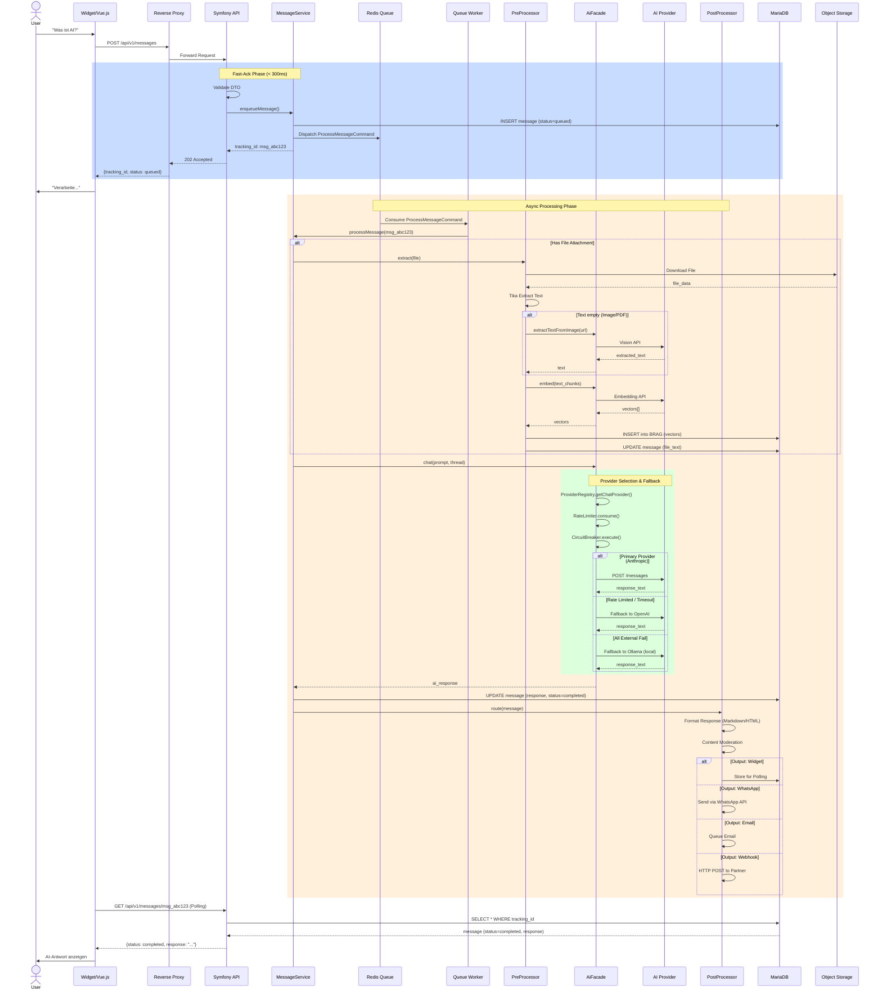
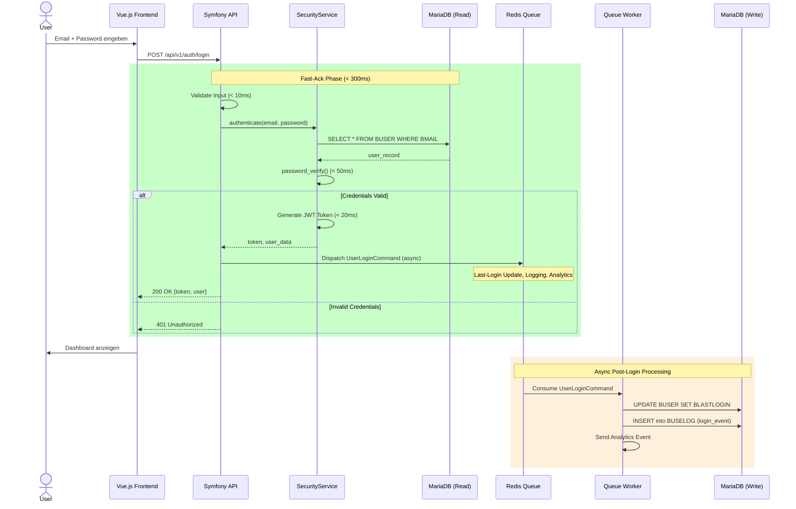
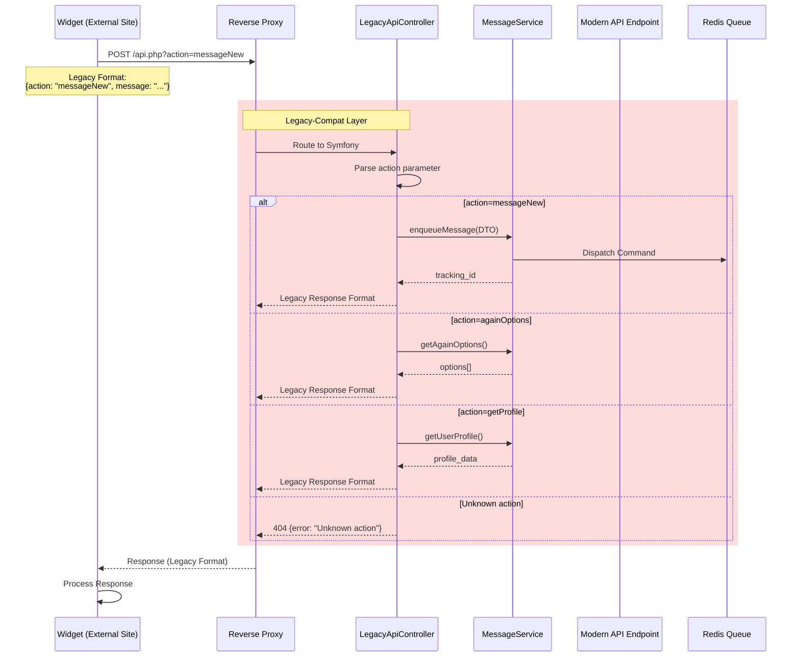
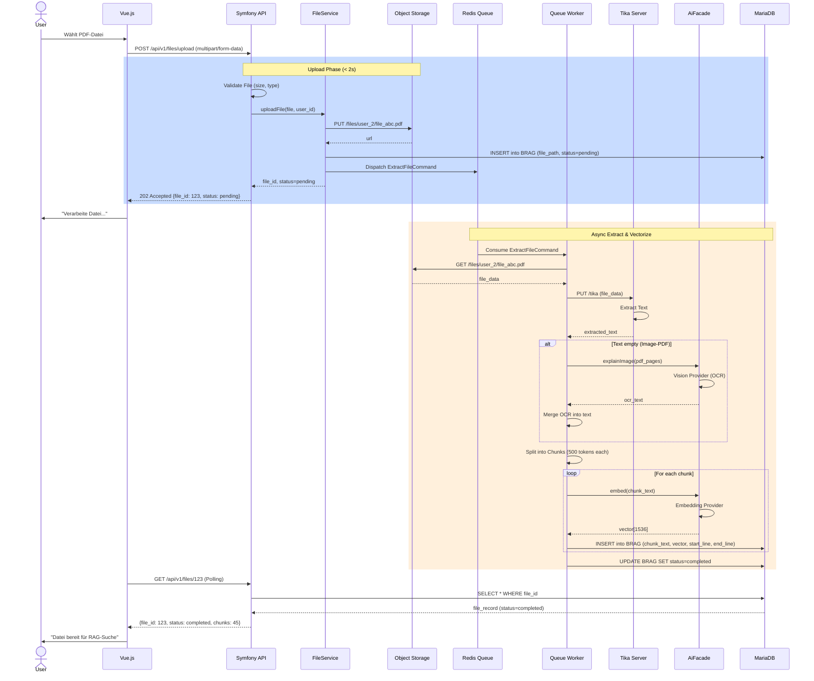
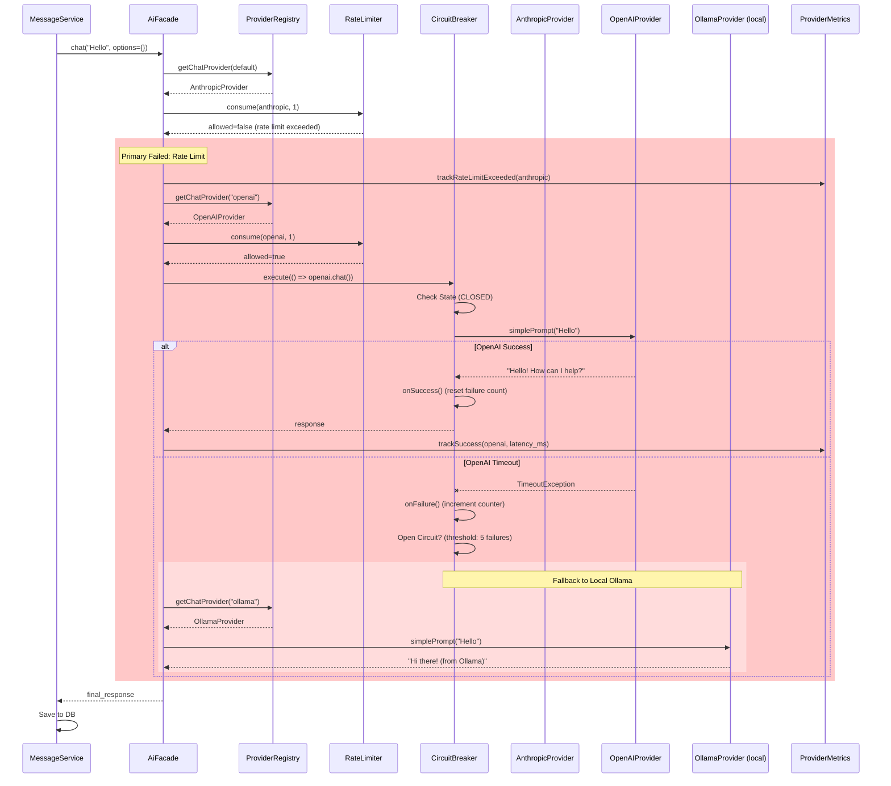
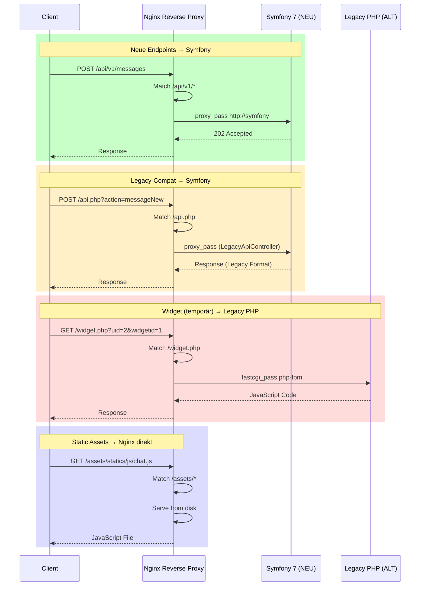
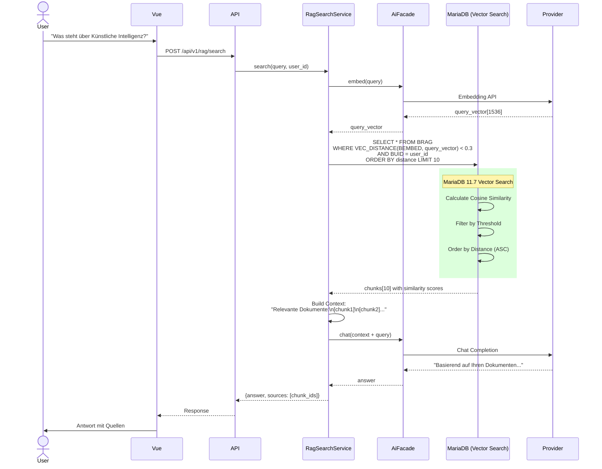

# Synaplan Symfony 7 Migration – Sequenzdiagramme

## Übersicht

Diese Dokumentation enthält **Mermaid-Sequenzdiagramme** für alle kritischen Request-Flows im Synaplan-System.

---

## 1. Request → Pre → AI → Post → Output (Haupt-Flow)

**Kontext**: Ein User sendet eine Chat-Message über Widget oder Vue.js Frontend.



**Input** (POST `/api/v1/messages`):
```json
{
  "text": "Was ist AI?",
  "user_id": 2,
  "widget_id": 1,
  "files": []
}
```

**Output** (Fast-Ack):
```json
{
  "tracking_id": "msg_abc123",
  "status": "queued",
  "estimated_time_seconds": 10
}
```

**Output** (Polling GET `/api/v1/messages/msg_abc123`):
```json
{
  "tracking_id": "msg_abc123",
  "status": "completed",
  "response": "AI (Artificial Intelligence) ist...",
  "provider": "anthropic",
  "model": "claude-3-5-sonnet-20241022",
  "duration_ms": 1234
}
```

---

## 2. Login Fast-Ack (< 300ms)

**Kontext**: User loggt sich ein, Backend muss schnell antworten.



**Input**:
```json
{
  "email": "synaplan@synaplan.com",
  "password": "synaplan"
}
```

**Output** (< 300ms):
```json
{
  "token": "eyJhbGciOiJIUzI1NiIsInR5cCI6IkpXVCJ9...",
  "user": {
    "id": 2,
    "email": "synaplan@synaplan.com",
    "level": "NEW",
    "details": {
      "firstName": "Test",
      "lastName": "User"
    }
  },
  "_debug": {
    "response_time_ms": 245
  }
}
```

**Performance-Breakdown**:
- Input Validation: 10 ms
- DB Query (Read Replica): 50 ms
- Password Verify: 50 ms
- JWT Generation: 20 ms
- Queue Dispatch: 10 ms
- HTTP Response: 15 ms
- **Total**: ~155 ms (P50)

---

## 3. Widget-Kompatibilität (Legacy `action` → Neuer Endpoint)

**Kontext**: Bestehende Widget-Embeds nutzen `/api.php?action=messageNew`, müssen auf Symfony gemappt werden.



**Legacy Input** (POST `/api.php`):
```
action=messageNew
message=Hello
user_id=2
widget_id=1
```

**Internal Mapping**:
```php
// LegacyApiController
$action = $request->get('action');

$dto = match($action) {
    'messageNew' => new CreateMessageRequest(
        text: $request->get('message'),
        userId: (int)$request->get('user_id'),
        widgetId: (int)$request->get('widget_id')
    ),
    // ...
};

return $this->messageService->enqueueMessage($dto);
```

**Legacy Output** (kompatibel mit altem Format):
```json
{
  "tracking_id": "msg_abc123",
  "status": "queued",
  "success": true
}
```

---

## 4. File Upload mit Extract & Vectorize

**Kontext**: User lädt PDF hoch, Backend extrahiert Text und vectorisiert für RAG.



**Input**:
```
POST /api/v1/files/upload
Content-Type: multipart/form-data

------WebKitFormBoundary
Content-Disposition: form-data; name="file"; filename="document.pdf"
Content-Type: application/pdf

[PDF Binary Data]
------WebKitFormBoundary--
```

**Output** (Fast-Ack):
```json
{
  "file_id": 123,
  "filename": "document.pdf",
  "size_bytes": 524288,
  "status": "pending",
  "estimated_time_seconds": 30
}
```

**Output** (After Processing):
```json
{
  "file_id": 123,
  "filename": "document.pdf",
  "status": "completed",
  "chunks": 45,
  "total_tokens": 22500,
  "vector_dimensions": 1536,
  "group_key": "user_2_documents"
}
```

---

## 5. Provider-Fallback-Chain

**Kontext**: Anthropic ist rate-limited, System fällt automatisch auf OpenAI zurück.



**Fallback-Konfiguration**:
```yaml
# config/packages/ai.yaml
ai:
    fallback_chain:
        - anthropic
        - openai
        - ollama
    
    rate_limits:
        anthropic: 50/min
        openai: 100/min
        ollama: unlimited
    
    circuit_breaker:
        failure_threshold: 5
        timeout_seconds: 60
```

---

## 6. Strangler-Pattern Routing

**Kontext**: Nginx routet Traffic zu Alt oder Neu basierend auf Endpoint.



**Nginx-Config**:
```nginx
upstream symfony_backend {
    server symfony:8000;
}

upstream legacy_php {
    server php-fpm:9000;
}

server {
    listen 80;
    server_name synaplan.local;

    # Neue API → Symfony
    location /api/v1/ {
        proxy_pass http://symfony_backend;
        proxy_set_header Host $host;
        proxy_set_header X-Real-IP $remote_addr;
        proxy_set_header X-Forwarded-For $proxy_add_x_forwarded_for;
        proxy_set_header X-Forwarded-Proto $scheme;
    }

    # Legacy-Compat → Symfony (LegacyApiController)
    location /api.php {
        proxy_pass http://symfony_backend;
    }

    # Widget (temporär Legacy, später zu Symfony)
    location ~ ^/(widget|widgetloader)\.php$ {
        root /var/www/legacy/public;
        fastcgi_pass legacy_php;
        fastcgi_param SCRIPT_FILENAME $document_root$fastcgi_script_name;
        include fastcgi_params;
    }

    # Static Assets
    location /assets/ {
        root /var/www/legacy/public;
        expires 1y;
        add_header Cache-Control "public, immutable";
    }

    # Health-Check
    location /health {
        proxy_pass http://symfony_backend/api/health;
    }
}
```

---

## 7. RAG-Suche mit Vector-Similarity

**Kontext**: User fragt "Was steht in meinen Dokumenten über X?", System sucht ähnliche Chunks.



**Input**:
```json
{
  "query": "Was steht über Künstliche Intelligenz?",
  "user_id": 2,
  "group_key": "user_2_documents",
  "limit": 10,
  "threshold": 0.3
}
```

**SQL (MariaDB 11.7 Vector Search)**:
```sql
SELECT 
    BID,
    BTEXT,
    VEC_DISTANCE(BEMBED, VEC_FromText('[0.123, -0.456, ...]')) AS distance,
    BFILEPATH,
    BSTART,
    BEND
FROM BRAG
WHERE 
    BUID = 2
    AND BGROUPKEY = 'user_2_documents'
    AND VEC_DISTANCE(BEMBED, VEC_FromText('[...]')) < 0.3
ORDER BY distance ASC
LIMIT 10;
```

**Output**:
```json
{
  "answer": "Basierend auf Ihren Dokumenten: Künstliche Intelligenz (KI) ist...",
  "sources": [
    {
      "chunk_id": 123,
      "file_path": "documents/ai_report.pdf",
      "text": "KI ist ein Teilgebiet der Informatik...",
      "similarity": 0.92,
      "lines": "45-58"
    },
    {
      "chunk_id": 456,
      "file_path": "documents/tech_overview.docx",
      "text": "Machine Learning ist...",
      "similarity": 0.88,
      "lines": "12-24"
    }
  ],
  "total_results": 2
}
```

---

## Zusammenfassung

**Kritische Flows**:
1. **Request → Pre → AI → Post** (Haupt-Pipeline)
2. **Login Fast-Ack** (< 300ms)
3. **Widget-Compat** (Legacy-Mapping)
4. **File Upload** (Extract & Vectorize)
5. **Provider-Fallback** (Resilience)
6. **Strangler-Routing** (Migration-Strategie)
7. **RAG-Suche** (Vector-Similarity)

**Performance-Ziele**:
- Login: < 300 ms (P95)
- API (CRUD): < 500 ms (P95)
- AI-Processing: Async (non-blocking)
- File-Upload-Ack: < 2s

**Resilience-Patterns**:
- Circuit-Breaker
- Fallback-Chain
- Rate-Limiting
- Retry mit Exponential-Backoff

---

**Status**: ✅ Diagramme finalisiert
**Tool**: Mermaid (GitHub/GitLab/VSCode kompatibel)
**Review**: Ende Woche 1

